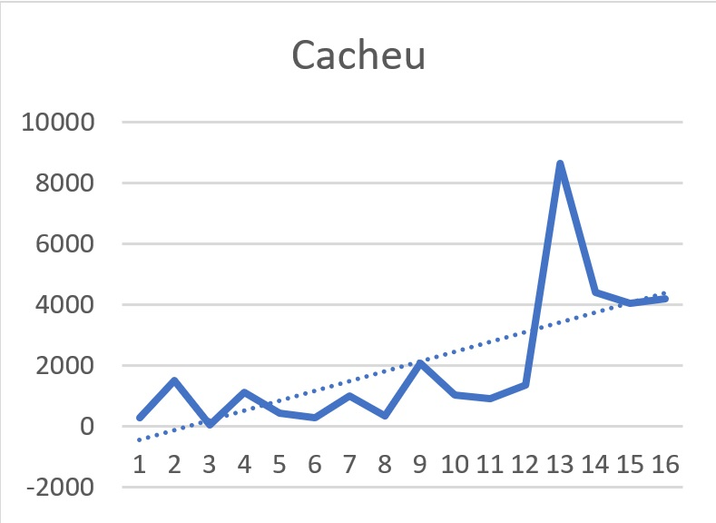
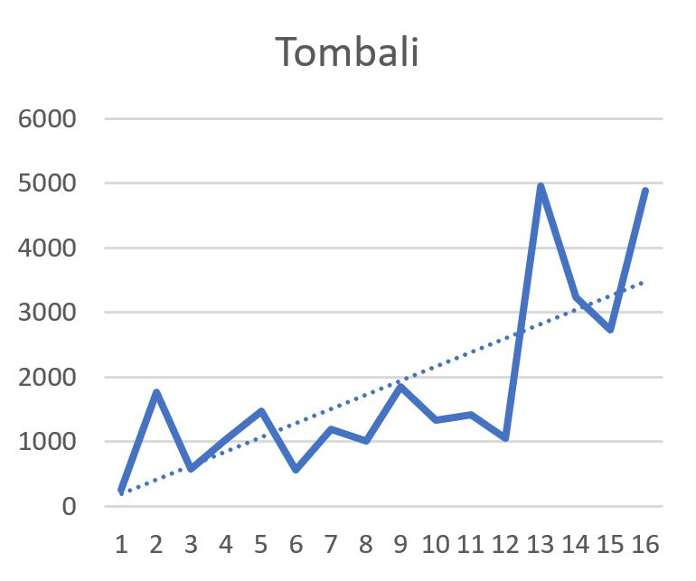
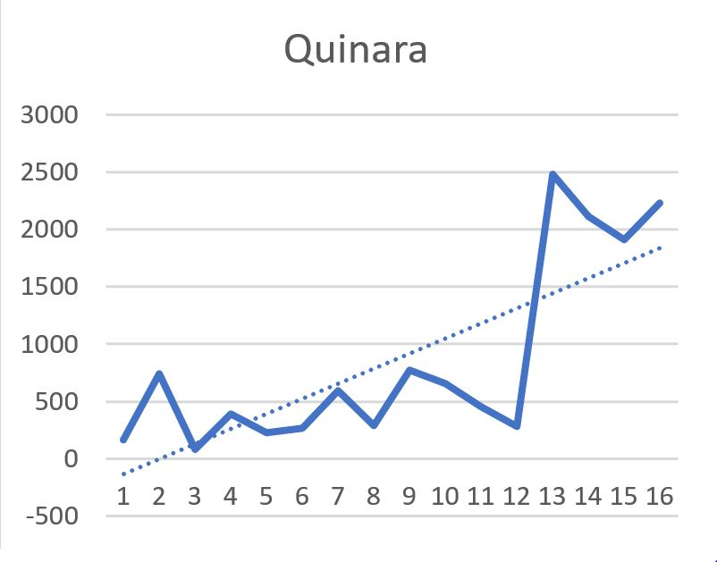
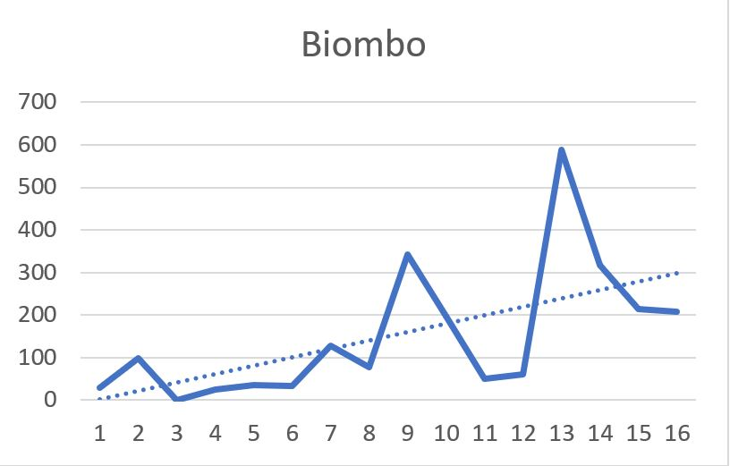
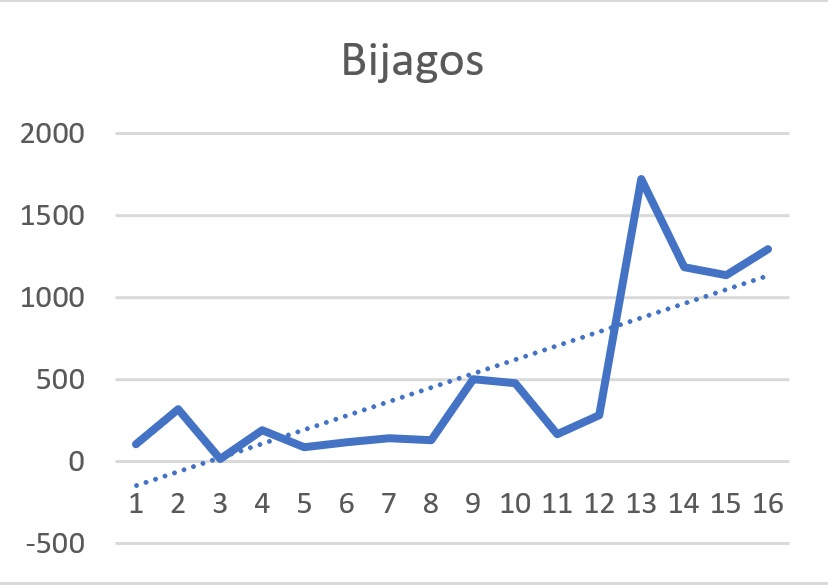
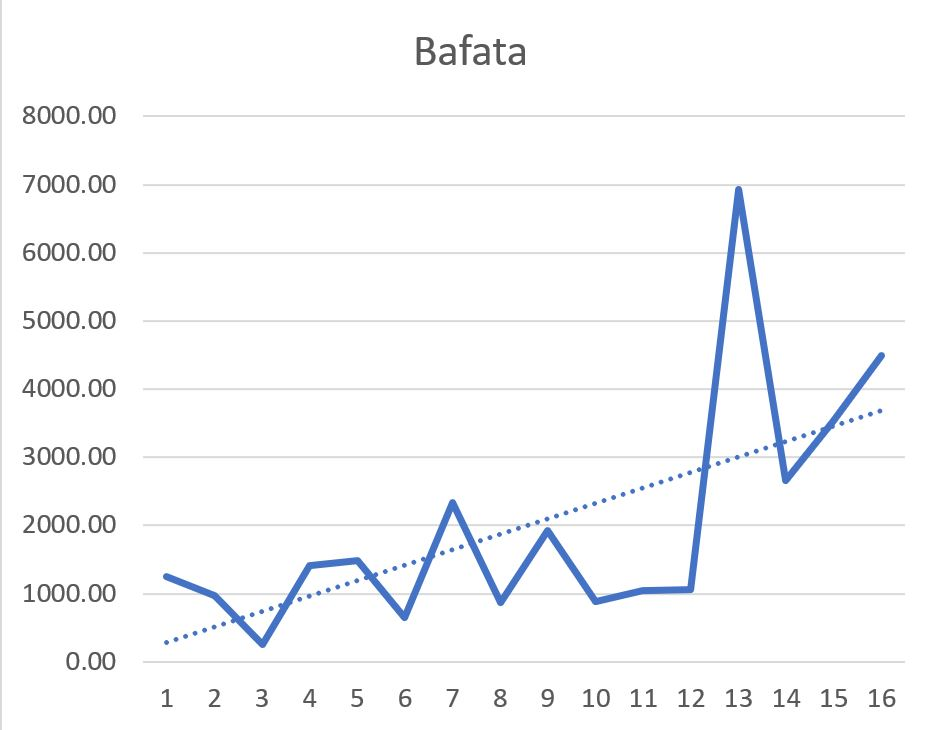
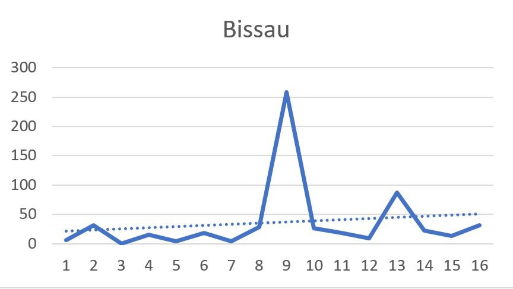
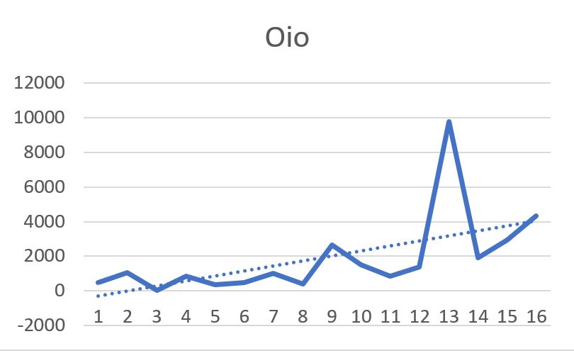
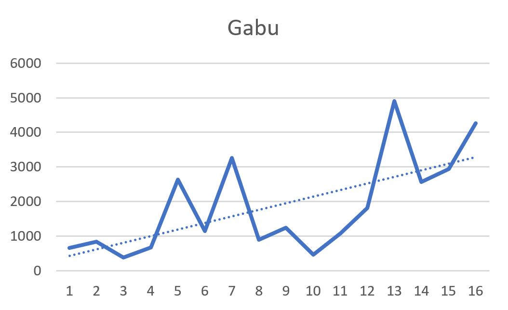

# Deforestation in Guinea-Bissau

## Introduction
Guinea-Bissau is a small west African country that has seen a significant increase in forest loss around the year 2012. 
Guinea-Bissau became known as Africa's first 'Narco-state' in 2005 after several high level military and political figures have
been arrested at implicated in drug trafficking. This project will focus on visually representing this forest loss with a 
focus on highlighting the years the Guinea-Bissau functioned as a narco-state and the landscpae transformations associated with
this illicit activity.

## Data
Using the Hansen Global Forest Loss dataset provides a 30m resolution of forest loss across the global since 2000. Using this 
dataset within Google Earth Engine multi-temporal analysis can quickly be performed. 

## Methods

[Here](https://code.earthengine.google.com/4e5dc5ac9be55b813aae3ac6ee2dfc4b) is a link to the code used to create this preliminary analysis  

## Results

There are nine administrative areas within Guinea-Bissau that can be separated into three regions:
#### Coastal  
1. Cacheu
2. Tombali
3. Quinara
4. Biombo

#### Islands
5. Bijagos

#### Inland
6. Bafata
7. Bissau
8. Oio
9. Gabu

### Forest Loss Rates per year by admin
 

Admin name | Forest loss 2012 | Forest loss 2013 | Percent increase 
-----------|--------------|-------------|---------------
Cahceu|86503067.31344783|44199336.500925824|631.41%
Tombali|49622289.82173762|32292034.08366436|468.13%
Quinara|24804945.697408997|21126804.92950535|880.74%
Biombo|5878339.207976697|3175797.4258032707|985.68%
Bijagos|17213629.73290776|11847267.754489316|617.24%
Bafata|69339460.99403459|26591985.847144034|660.38%
Bissau|869392.6719664332|224000.42966547946|914.28%
Oio|97968626.12190278|18964699.601516306|720.36%
Gabu|49064743.80216495|25688082.001148663|272.58%

>Created by Alex Walters for GEOG 572 at Oregon State University
